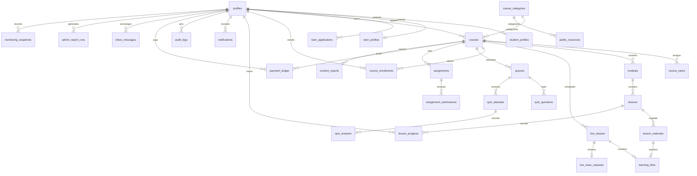

# Marketing, dashboards and LMS data model

The existing marketing HTML remains the public website. Its layout, sections, typography and navigation are preserved. Next.js serves that website and the compiled LMS dashboards under one origin, allowing the existing authentication modal and role redirects to continue working.

`npm run dev:web` rebuilds the existing dashboards, copies the production assets to `web/public/`, and starts Next.js on port 3000. Use `npm --prefix web run dev -- --port 3101` after `npm run prepare:web` when that port is occupied. Run `npm run prepare:web` after editing the original HTML, CSS or LMS modules; generated copies must not be edited directly. `npm run build:web` produces both builds. No PHP source or TypeScript source is copied to the public output.

Student, tutor and admin pages share the redesigned sidebar, top bar, cards, forms, tables and mobile drawer in `assets/css/app.css` and `assets/js/lms/ui.ts`. Role-specific content and database queries remain intact. Dashboards currently use the established browser Supabase session and PostgreSQL authorization. The Next.js cookie auth helpers are reserved for future React dashboard migration; they do not replace the existing session mechanism yet.

## Data relationships

`profiles` remains the authority for identity, role and account status. Student/tutor extensions hold role-specific details; they do not confer permissions. Existing rows are backfilled and a trigger provisions extensions on signup or role changes. Course metadata now supports categories, short descriptions, duration and learning objectives; the tutor builder can save the latter three. Categories and public resources have storage and RLS foundations; their dedicated management screens are still pending. Platform settings now have an admin management screen.

The course → module → lesson hierarchy is preserved. Denormalized course IDs on learning records remain checked by existing integrity triggers and support efficient ownership/enrollment policies. New live-class timezone metadata defaults to Africa/Lagos. Existing scheduling UI still uses that default; timezone selection and playback-position UI are future work.

Private provider destinations live in `learning_links`. Browsers cannot select that table. Authorized RPCs create and resolve links, enforcing ownership/enrollment and published lesson status. Public course projections contain curriculum titles, never protected provider destinations. Existing pointer files are retained for recovery: tutors can paste the original destination using Save link/Save meeting link. They are not automatically migrated because reading existing Storage objects requires a configured Supabase project.

Private contact messages are stored by the validated Next.js `/contact.php` endpoint and an insert-only database RPC. Only active admins can read/manage them. The endpoint does not claim email delivery. Per-email database throttling exists; production-wide bot protection should be configured at the hosting layer. Do not store secrets in `platform_settings`; that table is application configuration, not a secret vault.

## Migration and environment setup

Apply existing migrations 0001–0010 using the Supabase migration ledger, followed by 0011–0017. An existing project must receive only unapplied forward migrations. Back up its database first. Do not run seed.sql on a real user database: it creates disposable demonstration accounts.

The dashboard build reads `VITE_SUPABASE_URL` and `VITE_SUPABASE_ANON_KEY` from `eduleb/.env`. Set `VITE_PREVIEW_MODE=0` for deployment. Next.js reads `NEXT_PUBLIC_SUPABASE_URL` and `NEXT_PUBLIC_SUPABASE_ANON_KEY` from `eduleb/web/.env.local`. Both must reference the same Supabase project. Public keys are expected; no service-role key is needed in either browser configuration.

All 38 application tables have RLS enabled. New private tables default to no access. Internal audit/notification primitives are revoked from direct client execution. Existing security-definer workflows continue to call them as their owner. Public categories/resources expose only active/published content. Course publication and user-role transitions retain existing privileged workflows.

## Current verification and limitations

Local TypeScript, lint, builds, migration execution, existing authorization/workflow tests and new provider-link/domain tests are used for verification. PGlite tests emulate Supabase Auth/Storage and are not live integration tests. Supabase credentials are not configured locally; live signup, email, RLS through PostgREST and deployed contact persistence remain unverified.

Marketing structure is preserved as requested, including its visibly marked placeholder courses, pricing, testimonials, employer logos and contact details. Those must be replaced with approved content or database-driven sections before production launch. The native Next.js `/courses` catalogue already uses safe published-course projections; the original marketing `/course.html` remains illustrative. Payments, certificates, external provider APIs and email automation have not been added.

## Admin reference implementation — migrations 0015–0016

The admin shell now follows the supplied screenshot: dark sidebar, search, notification/message links, account menu, six summary cards, three-column overview and the lower course/class/system panels. Student and tutor marketing/dashboard structures remain intact.

New routes: `/admin/tutors`, `/admin/students`, `/admin/enrollments`, `/admin/live`, `/admin/notifications`, `/admin/reports`, `/admin/audit`, `/admin/settings`, `/admin/messages`, `/admin/payments`, `/admin/moderation`, `/admin/search`, `/admin/course`. Message recipients can read their inbox under `/student/messages` or `/tutor/messages`. Admin search covers profile names, course titles and lesson titles and leads to filtered users or course details.

`payment_ledger` is an immutable, admin-recorded ledger of verified payments/refunds in NGN minor units (kobo), with unique receipt references. It does not charge cards, initiate refunds or automatically grant paid access. Enrollment administration explicitly grants/cancels access. Revenue totals net payments and refunds; the chart uses a separately labelled currency scale. Date filters affect daily analytics; summary cards remain all-time totals.

`live_class_requests` holds optional tutor-requested reviews. Existing classes are preserved; requesting review hides a meeting from students until approval. Pending/rejected requests block row visibility, provider resolution, legacy signing and private Storage reads. Admin rejection cancels the class. `content_reports` accepts issues only from users authorized to access that course; admins can resolve/dismiss with a review note.

`inbox_messages` is private to its sender/recipient. Admin sending also creates an in-app notification. No email delivery is implied. `admin_report_runs` stores date-bounded analytics snapshots; the reports page creates and downloads CSVs and allows re-downloading saved snapshots. CSV output escapes formula prefixes. Admin-only RPCs enforce authorization and dates up to 367 days.

`monitoring_snapshots` records readings manually from a named source. Uptime, storage and bandwidth remain unavailable until a reading is supplied; readings show their measurement time and source. Automatic hosting telemetry is not connected. System settings allow site name, support email, default timezone and maintenance notice. The admin brand/notice reflect saved settings; validated timezone defaults apply to newly created classes. Support email is stored for application configuration and does not configure email delivery.

Lists show the latest 200 records, with report history limited to 30. Larger production data sets will need pagination. Preview changes are not persisted; database-backed writes require both environment configurations to reference the same Supabase project. The generic DOM helper's event binding was repaired so button/form actions run correctly.

## Student and tutor image implementation — migration 0017

Both dashboards follow the supplied reference layouts. Student: Continue Learning photo banner, four course cover cards, next/upcoming classes, progress ring and recent activity/notification tabs. Tutor: purple workspace, four metrics, course completion list, upcoming class controls, student activity and four review queues. Metrics use actual enrolled/managed data; revenue is the tutor’s net allocated NGN earnings. Preview fixtures are labelled and new persistent actions require Supabase.

Six private tables support these screens: `course_questions`, `course_reviews`, `quiz_attempt_reviews`, `course_certificates`, `tutor_earning_entries`, and `learning_events`. All have RLS and no direct client writes. Authorized RPCs handle mutations and audit them. Questions/reviews are private to the learner and course managers; quiz reviews are acknowledgements of automatic scores, not score overrides. The tutor course directory now filters to authored/assigned courses, and preview notifications and pending submissions respect the selected persona.

Student feedback, tutor answers/replies, quiz review acknowledgement, content directories, scoped search, activity, and earnings pages are routed. Join and Start resolve protected provider URLs; joining records a bounded activity event and respects live-review approval guards. Class times show the configured timezone. Upcoming classes are filtered by date/status; no provider calendar integration is assumed.

Course certificates require all published lessons completed, each published quiz passed, and every published assignment graded at least 50% with results released. The server validates eligibility; name/title/issue date are frozen and issuing is idempotent. Students can print/save the issued certificate as PDF. These represent course completion, not ICAN professional accreditation; public verification is not implemented.

Admins record tutor allocations, reversals, and externally completed payouts on Payments & Refunds. Allocations require a verified receipt for a course the tutor teaches and cannot exceed that receipt. Reversals cannot exceed the original allocation; payouts cannot exceed the net unpaid balance. Corrections can create an amount to recover when a payout already occurred. Entries are immutable to clients. This records earnings and payments; it does not transfer money or connect a payment processor. Larger data sets require pagination beyond the latest 100 feedback/review records and 200 earnings entries.

Apply migration 0017 after the prior migrations on the configured Supabase project. This workspace has no Supabase credentials, so schema execution and role tests use isolated PostgreSQL locally; no remote migration or live browser persistence is claimed.
